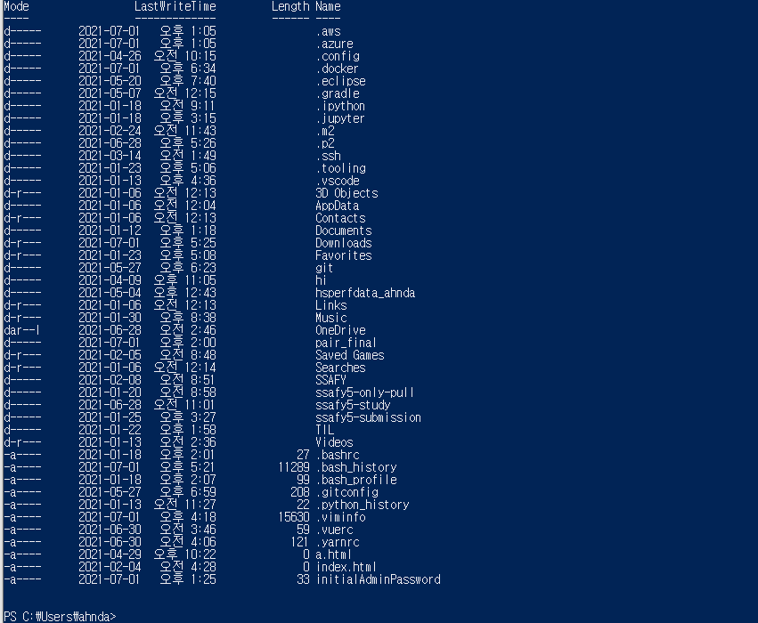
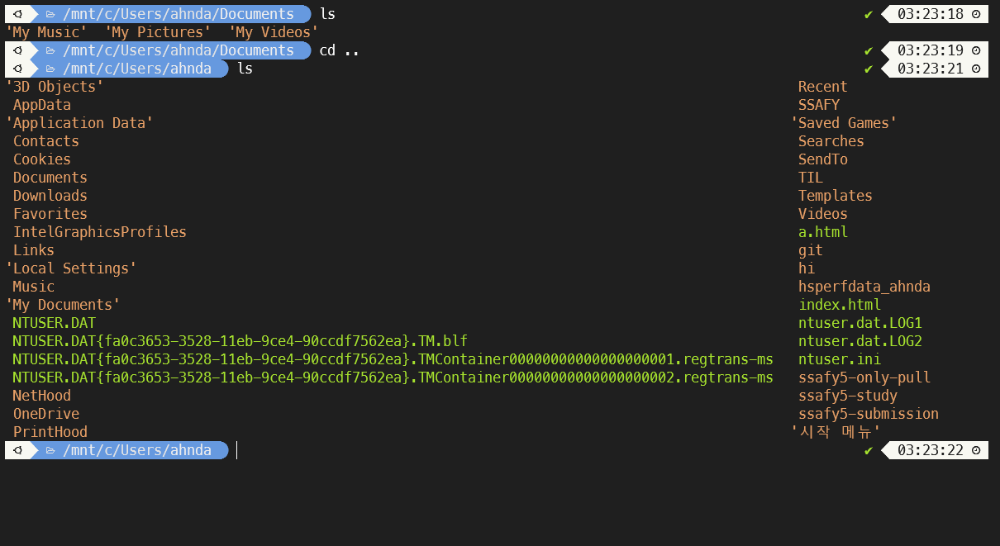
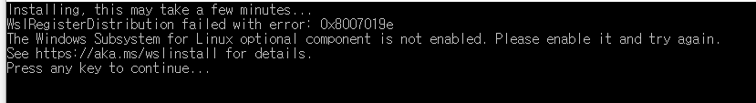

# 리눅스 환경 구축
## 진행한 방식

WSL2

## WSL2를 선택한 이유

Virtual Box의 경우 속도가 느리고 무겁다.

따라서 WSL2와 클라우드 둘중 하나를 선택해야 했는데, 클라우드의 경우 무료이긴 하지만 신용카드가 필요하고 추후에 잘못 사용했다간 유료가 될 수 있다. 또한 1년동안만 무료이기때문에 WSL2를 사용하는 것이 가장 안전하다고 생각이 들어 사용하게 되었다.

## Chocolately

윈도우의 Chocolately를 통해 프로그램 설치를 쉽게할 수 있다.

1. Power Shell 관리자 권한으로 실행 후, Chocolately를 설치
2. Power Shell 관리자 권한으로 실행 후, 프로그램 설치 cli를 입력하면 바로 실행이 된다.(adobe, chrome, java, Git... 등)

## WSL 설치방법

1. Microsoft Store에서 Terminal을 검색 or Chocolately에서 Terminal 검색
2. Power Shell(관리자 권한으로 실행)에서 `choco install microsoft-windows-terminal` 를 통해 설치
3. windows terminal을 실행
   - wihndows 터미널에서 power shell, 명령 프롬프트, azure cloud shell을 사용할 수 있다.
4. 구글에서 enable wsl2 검색
   - 터미널(관리자 권한으로 실행)에 `dism.exe /online /enable-feature /featurename:Microsoft-Windows-Subsystem-Linux /all /norestart` 실행
5. Microsoft Store에서 ubuntu를 설치
   - Ubuntu 20.04 LTS를 설치해주었음
6. 설치후 우분투를 켜고 id, password를 설정
   - 나의 경우, id는 `ahndae`이고 password는 `비밀`

7. 이제 WSL2로 업데이트를 해야한다.
   1. terminal(관리자권한으로) 실행 후 `dism.exe /online /enable-feature /featurename:VirtualMachinePlatform /all /norestart` 실행
   2. 재부팅
   3. terminal(관리자권한으로) 실행 후 `wsl --set-default-version 2` 실행 (WSL2를 기본 버전으로 설정한 것임)
   4. https://aka.ms/wsl2kernel로 가서 Linux kernel update 패키지 다운로드
   5. WSL에다가 ubuntu에 WSL2를 사용할 것이라는 걸 알려줘야 한다.
      - 다시 terminal 관리자권한으로 실행 후 `wsl --list --verbose`로 ubuntu의 이름을 알아내고 `wsl --set-version Ubuntu-20.04 2` 실행
   6. 여기까지 하면 WSL2 설치 완료!

## Terminal(WSL2) 커스터마이징

먼저 Terminal 실행후, 설정으로 들어가서 default를 ubuntu로 설정

### oh my zsh

#### google에 oh my zsh 검색 (terminal을 이쁘게 꾸며주는 것이다.)

1. zsh 설치
   - `sudo apt install zsh` 실행

2. terminal(ubuntu)에서 `sh -c "$(curl -fsSL https://raw.githubusercontent.com/ohmyzsh/ohmyzsh/master/tools/install.sh)"` 실행하여 `oh my zsh` 설치하면 설치완료!

setting.json의 profiles에서 `"colorScheme": "Monokai Night"` 로 설정 (이렇게 색깔을 마음대로 설정해줄 수 있다.)

terminal splash 사이트에서 다양한 테마들을 볼 수 있다. 마음에 드는 테마의 코드를 가져와서 schemes에 그대로 붙여넣어 주면 된다.

- 나는 그중 Monokai Night를 사용하였다.

#### 이제 zsh를 위한 테마인 'Powerlevel10k'를 설치

1. `sudo git clone --depth=1 https://github.com/romkatv/powerlevel10k.git ${ZSH_CUSTOM:-$HOME/.oh-my-zsh/custom}/themes/powerlevel10k`로 설치

2. .zshrc 파일(`code ~/.zshrc`로 들어가면 됨)을 수정해주어야 한다.
   - zshrc파일 내부에서 `ZSH_THEME="powerlevel10k/powerlevel10k"` 로 바꿔주면 된다.

3. 폰트또한 `MesloLGS NF`로 바꿔주어야한다.

   -  https://github.com/romkatv/dotfiles-public/tree/master/.local/share/fonts/NerdFonts 에서 먼저 폰트를 다운받는다.

   - settings.json의 profiles에서 "defaults": {

        "colorScheme": "Monokai Night",

        "fontFace": "MesloLGS NF"

       },로 폰트 설정해준다.

   - vs code의 settings에 가서 integrated terminal font family에서 폰트를 'MesloLGS NF'로 바꿔주면 끝!

아직도 폴더의 테마색이 좋지않으니 바꿔주는게 좋다.

1. `code ~/.zshrc`로 들어간다.
2. 맨 마지막줄에 `LS_COLORS="ow=01;36;40" && export LS_COLORS`를 추가 (이건 내가 맘에 드는 테마로 바꾼 것임)

### 이전 모습

#### 최종 결과 사진

이렇게 이쁘게 terminal이 바뀌었다.

#### 만약 다시 powerlevel10K 환경 설정을 하고 싶다면`p10k configure`를 입력하면 된다!!!

## 진행하면서 문제가 있었지만 해결한 내용

우분투를 처음 설치할 때 이러한 오류가 생겨서 많이 애를 먹었다.

1. 설정을 Linux용 Windows 하위 시스템으로 설정해주고 재부팅해주었다.
2. ubuntu를 삭제하고 wsl update 파일을 설치후 다시 ubuntu를 설치해주었다.

두 가지 모두 해보니 문제를 해결할 수 있었다.

[문제 해결 출처1](https://baejangho.com/entry/WindowsWSL-WSL-2-%EC%84%A4%EC%B9%98%EC%A4%91-WslRegisterDistribution-failed-with-error-0x800701bc-%EB%AC%B8%EC%A0%9C)

[문제 해결 출처2](https://hatpub.tistory.com/79)

