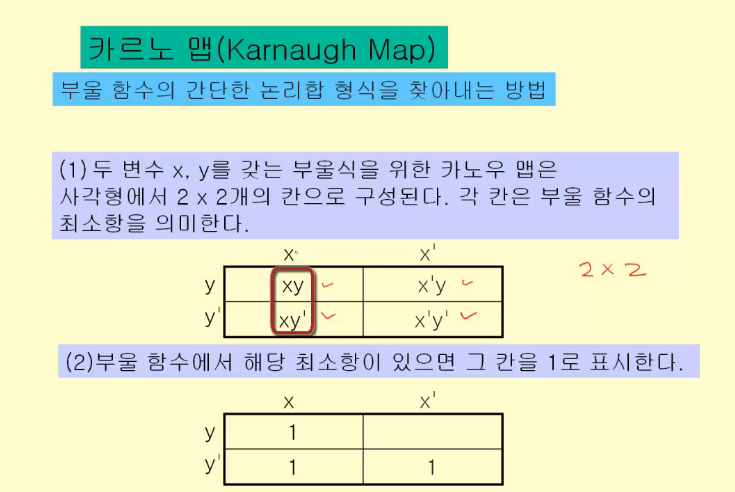

영상: https://www.youtube.com/playlist?list=PLD8rdlfZeJk7ijUM8ckwLLNyDKRD2aQa2

## [명제와 연산자](/이산수학/이산수학-기초/명제와-연산자.md)

## 추론,연역법과 귀납법

> 추론: 우리는 이미 '참'으로 알고있는 명제로부터 새로운 '참'인 명제를 찾아내려고 한다. 이러한 과정을 통해서 새로운 지식을 얻게 된다. 이러한 과정을 추론이라고 한다.

### 추론의 두 가지 종류 (연역법, 귀납법)

#### 연역법

> 일반적으로 알려진 전제(이론)을 어떠한 현상에 대입시켜 이에 대한 결론을 도출해내는 방법

수학의 이론은 연역법에 의해 만들어진 명제들로 이루어진다.

전제: Axiom(공리, 가정), 정의, 이미 증명된 정리 -> 결론: conclusion(정리, lemma)

#### 귀납법

> 개별적인 사실을 말하는 명제들로부터 일반적인 결론을 도출하는 방법
>
> 귀납법의 문제는 현실적으로 집합의 모든 원소에 대해서 참인 것을 밝힐 수 없다는 점이다. 따라서 도출괸 결론은 기껏해야 확률적인 결론일 수 밖에 없다.

P(X1,y) is True, P(X2,y) is True, ... , P(Xn, y) is True -> 모든 P(x,y) is True (이처럼 모든 원소가 참이어야 한다는 것을 증명해야 한다.)

## 수학적 귀납법

> 수학적 귀납법은 귀납법의 한계를 극복
>
> 집합의 모든 원소에 대해서 명제가 성립하는 것을 보여준다. 따라서, 모든 경우의 명제가 성립하는 것을 증명할 수 있다.

ex)

1. n = 1일때, P(X1)이 참임을 보인다.
2. n = k(k>1) 일때, P(Xk)이 참임을 가정한다.

3. n = k+1 일때, P(Xk+1)이 참임을 보인다.

-> 그렇다면 모든 n에 대해 P(Xn)에 대해서 참인 것이 증명된다.

## [부울 대수(Boolean Algebra)](부울-대수.md)

## 논리회로 설계

### 게이트와 부울 연산

> 전자장치의 입력과 출력은 0또는 1이기 때문에 전자회로를 설계하는데 부울 대수를 사용할 수 있다.
>
> 게이트: 회로의 기본요소

| 기본 게이트      | 부울 연산 |
| ---------------- | --------- |
| 인버터(inverter) | 보수      |
| OR 게이트        | 부울 합   |
| AND 게이트       | 부울 곱   |

예시)

### 논리 회로 설계

주어진 문제 -> 입력과 출력 정의 부울 함수 -> 부울식(논리식) -> 논리회로

위의 문제에서 빨간색으로 칠해진 부분에 대해 output을 내는 논리합 형식은

F(x,y,z,w) = x'y'z'w' + x'y'zw' + x'yzw' + xy'z'w' 이다.

이 부울식이 가장 최소항의 식인지 확인해 보아야 한다.

이제 다음장에서 부울식의 최소항을 구하는 법을 알아보자

### 부울식의 최소화 (카르노 맵)

맨 오른쪽의 부울식이 왼쪽의 부울식에 대해 최소화한 식이다. (증명을 통해 항등식이라는 것을 알 수 있다.)

#### 카르노 맵을 통해 찾을 수 있다.

> 카르노맵이란 부울 함수의 간단한 논리합 형식을 찾아내는 방법

#### 예제:

#### 카노우 맵을 활용해서 이제 최소 부울 식을 구할 수 있다. (두 개의 변수 2*2)

위처럼 인접한 행이나 열이 있으면(겹치는 부울 값이 있으면) 하나의 값으로 표현할 수 있다.

#### 세 개의 변수를 가진 카노우 맵 (4*2)

인접한 4개의 칸으로 볼 수 있다. 단, 맨 왼쪽칸과 맨 오른쪽칸은 서로 연결되어 있다고 간주한다.

#### 세 개의 변수를 가진 카노우맵 예시

#### 카노우맵 정리

주의할 점은 칸들을 만들 때, 옆의 칸들은 모두 같은 변수로 이어져 있어야 한다.

#### 4개의 변수를 갖는 카노우맵 예시

#### 예시 2

이 경우 최소항은 xz + x'y' + zw' 이다.

하지만, 실수로 한번 더 묶어서 xz + x'y' + zw' + y'z가 되는 경우가 생길 수도 있다. 이런경우 항이 4개가 되므로 최소가 아니다.

xz + x'y' + x'zw' 이 식도 동일하지만 이것도 더 복잡한 식이기 때문에 최소라고 할 수 없다.

### 다시 아래의 예제를 봐보자

5번위치를 기준으로 input, output을 봐보자.

카노우 맵이 위에처럼 만들어지고 그 식에서 최소항을 구하면 x'zw' + y'z'w' 이 된다.

### 부울식의 쌍대 예시

