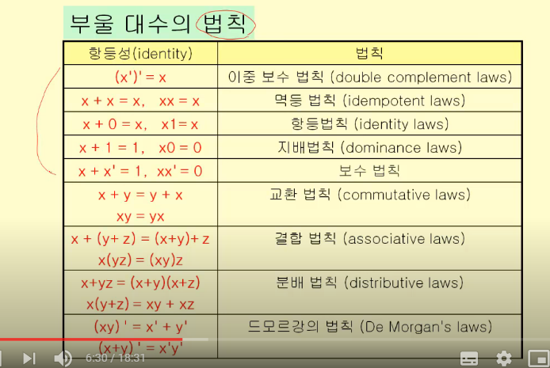

# 부울-대수

> 논리회로설계 문제풀이순서: 입력, 출력 정의 -> 부울함수 -> 부울식 -> 부울식 최소화 -> 논리회소

이를 위해 부울-대수(부울 함수, 부울식, 부울식 최소화)에 대한 개념이 필요하다.

집합 S={0,1}에 대해 다음의 세 가지 연산이 있다.

- 보수: `로 표시
- 부울 합: +로 표시
- 부울 곱: · 로 표시

연산 우선순위: 보수, 곱, 합의 순서

- 부울 변수
  - 집합 S={0,1}의 원소 값만을 갖는 변수
- 부울 함수
  - 0또는 1의 입력값들에 대해 0또는 1의 출력값을 갖는 함수
- 차수 n의 부울 함수
  - n-튜플의 입력 변수를 갖는 함수 (n개의 입력값을 갖는 함수)

#### 부울식

> x1, x2, ..., xn: 부울 변수
>
> 1. 0, 1, x1, ..., xn은 부울식이다.
> 2. E1, E2가 부울식이면 E1, (E1 · E2), (E1 + E2) 도 부울식이다.

#### 부울함수

> 부울 변수와 부울 연산자로 구성된 부울 식으로 표현한 것

예) 부울함수 F(x, y, z) = xy + z 일때 부울 함수 값을 다음과 같이 구할 수 있다.

| x    | y    | z    | xy   | z    | F(x,y,z) |
| ---- | ---- | ---- | ---- | ---- | -------- |
| 1    | 1    | 1    | 1    | 0    | 1        |
| 1    | 1    | 0    | 1    | 1    | 1        |
| 1    | 0    | 1    | 0    | 0    | 0        |
| 1    | 0    | 0    | 0    | 1    | 1        |
| 0    | 1    | 1    | 0    | 0    | 0        |
| 0    | 1    | 0    | 0    | 1    | 1        |
| 0    | 0    | 1    | 0    | 0    | 0        |
| 0    | 0    | 0    | 0    | 1    | 1        |

#### 항등

> n개의 변수로 이루어진 부울 함수 F,G가 있을 때, 모든 변수 x1, ..., xn에 대해 F(Xn) = G(Xn)이면 함수 F와 G는동등하다고 한다. 즉, 동일한 변수값에 대해서 진리표의 결과값이 동일하면 두 부울 함수는 동등하다.

#### 부울 대수의 법칙

#### 쌍대성의 원리

> 부울 대수의 모든 항등 법칙에 대하여 다음 2개의 식이 쌍으로 존재한다.
>
> x + 0 = x, x · = x 이러한 쌍을 쌍대라고 한다.
>
> 부울식으로 표현된 함수들 사이에서 항등성이 유지되면, 이들의 쌍대도 항등성을 유지한다.

#### 최소항

> n개의 부울 변수(x1, x2, .. , xn)으로 이루어진 부울식이 있을 때, 이 부울식의 최소항은 부울 곱 y1y2...yn이다.
>
> 이때, yi= xi 또는 yi=-xi 이다.

#### 논리합 형식: 곱들의 합

> 부울 함수를 최소항들의 부울 합으로 나타내는 형식
>
> 부울 함수의 부울식은 함수의 값이 1이되는 변수값의 조합들에 대하여 최소항들을 구하고 그 최소항들의 부울 합을 취하면 구할 수 있다.

예제1: 다음과 같은 값을 갖는 부울 함수를 부울식으로 표현하라

| x    | y    | F(x,y) | 표현                            |
| ---- | ---- | ------ | ------------------------------- |
| 1    | 1    | 1      | xy                              |
| 1    | 0    | 0      | 값이 1이 아니기 때문에 안해도됨 |
| 0    | 1    | 1      | x`y                             |
| 0    | 0    | 1      | x`y`                            |

따라서, F(x,y)는 xy + x'y + x'y' 이다.

예제2:

| x    | y    | z    | F(x,y,z) | 표현  |
| ---- | ---- | ---- | -------- | ----- |
| 1    | 1    | 1    | 0        | -     |
| 1    | 1    | 0    | 1        | xyz'  |
| 1    | 0    | 1    | 0        | -     |
| 1    | 0    | 0    | 0        | -     |
| 0    | 1    | 1    | 0        | -     |
| 0    | 1    | 0    | 1        | x'yz' |
| 0    | 0    | 1    | 0        | -     |
| 0    | 0    | 0    | 0        | -     |

따라서, F(x,y,z) = xyz' + x'yz'이다.

