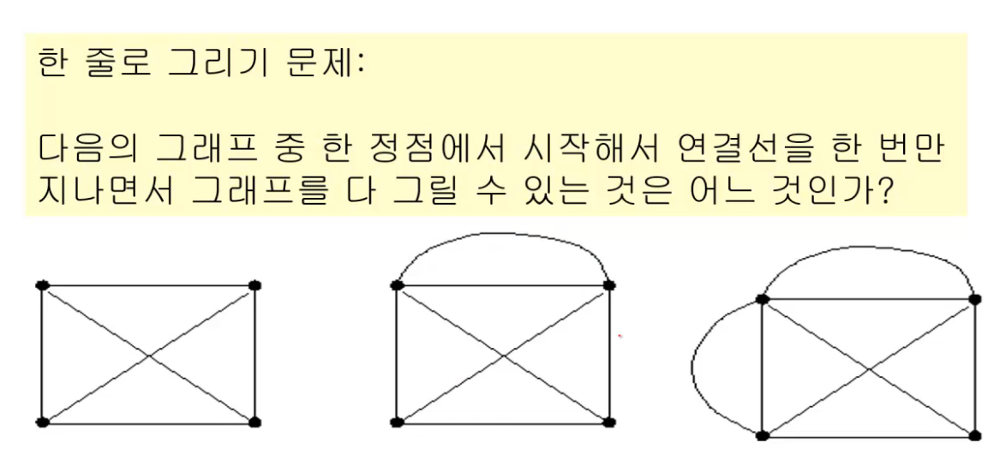
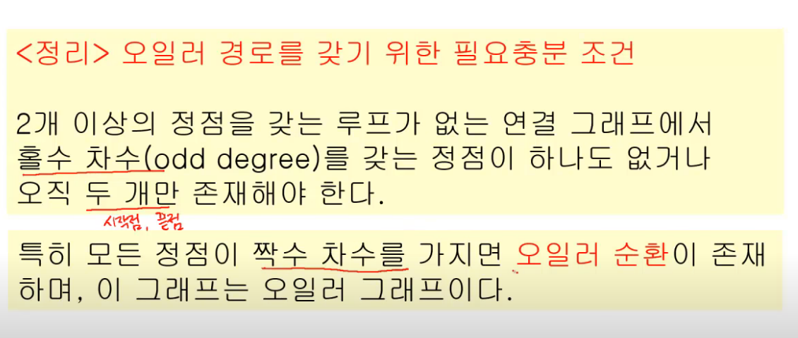
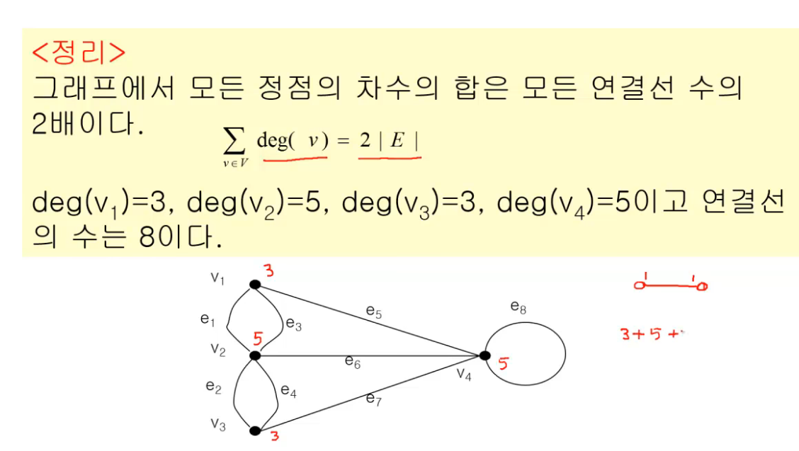
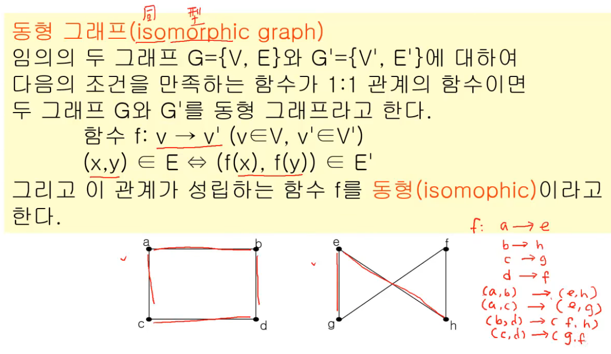
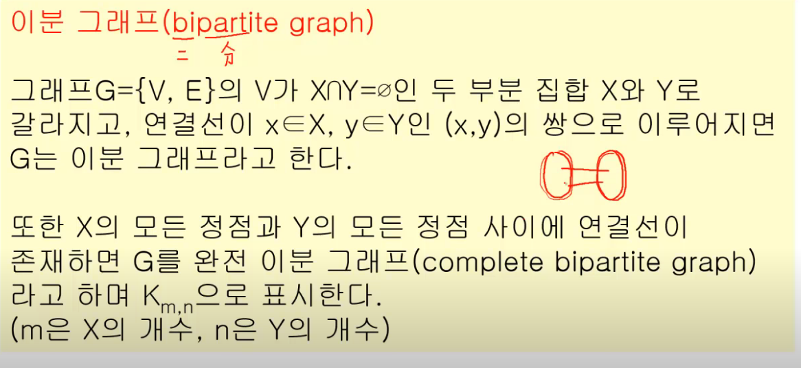
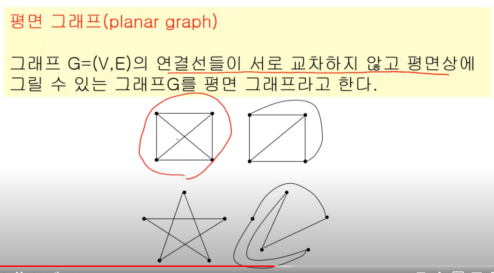

영상: https://www.youtube.com/playlist?list=PLD8rdlfZeJk6evHY9NsnBqXKrreNbTqFv

# 알고리즘과 그래프

## 1. 알고리즘

- 문제를 해결하기 위한 절차를 기술한 것
- 누구나 정해진 절차대로 실행할 수 있어야 한다.
- 누구나 동일한 입력값이 주어지면 이 절차대로 실행하면 동일한 출력값을 얻을 수 있어야 한다.
- 일정한 시간안에 출력값을 구할 수 있어야 한다.

Formal하게 정의해보면

- 순서대로 정의된 절차
  - 분명한 순서가 있어야 한다.
  - 한 동작을 실행하면 다음에 실행할 동작이 무엇인지 분명해야 한다.
- 명확성
  - 모든 동작은 명확하게 정의되어야 한다.
  - 모든 동작은 실행 가능해야 한다.
- 반드시 원하는 결과가 나와야 한다.
- 일정한 시간안에 실행되어야 한다.

### 알고리즘 기술 방법

1. 플로우차트
2. 프로그램 언어의 코드
   - 이것을 특정 프로그램 언어의 문법을 알아야 한다.
   - 또 코드 수준으로 자세히 적을 필요는 없다.
3. Pseudocode (수도코드)
   - 프로그램 언어의 코드 전 단계로 프로그램 언어들이 사용하는 구조를 그대로 이용한다.

## 2. 오일러 순환과 해밀턴 순환

### 오일러 경로 or 한 줄로 그리기 문제 (한붓 그리기)

### 

### 차수

정점 u에 접합된 연결선의 수, 차수는 `deg(u)`와 같이 표기하기도 한다.

### 오일러 경로의 시작점, 중간정점, 끝점

- 시작점
  - 나가야 하기 때문에 시작점의 차수는 홀수여야 한다.
- 중간정점
  - 중간정점은 들어왔다가 나가야하므로 중간정점의 차수는 반드시 짝수여야 한다.
  - 홀수라치면 들어왔다가 나갔다가 다시 들어오면 나갈수가 없기 때문에 끝점이 될 수 밖에 없다.
- 끝점
  - 마지막으로 들어와야 하기 때문에 끝점의 차수는 홀수여야 한다.

### 오일러 경로의 알고리즘 복잡도

n개의 차수를 다 고려해보고 홀수가 2개인지를 찾으면 된다.

n * 차수 <= n*(n-1) <= n2

### 해밀턴 경로, 해밀턴 순환

> 해밀턴 경로: 그래프 G에서 모든 정점을 정확히 한 번만 지나는 경로 (연결선이 아니고 정점을 한번만)
>
> 해밀턴 순환: 시작점과 끝점이 같은 해밀턴 경로

#### 시간복잡도

해밀턴 경로의 경우 알고리즘이 딱히 존재하기 않기 때문에 모든 방법을 다 해보는 브루트포스 알고리즘이다.

### 방문 판매원 문제

- 연결선에는 비용이 주어진다.
- 일반적으로 완전 그래프
- 이 그래프에서 비용이 최소가 되는 해밀턴 순환을 찾는 문제
- Exhaustive search

## 3. 그래프 기본 용어

> 그래프 G는 다음의 두 가지 집합으로 구성되며 `G = {V,E}`로 표시한다. 여기서 V는 `정점`(vertex)들의 집합이며, E는 정점들을 연결하는 `간선`(edge)들의 집합이다.

> 두 정점 u와 v사이에 연결선이 존재하면 두 정점은 열결되었다고 한다.

- 길이: 두 정점의 경로를 구성하는 연결의 수
- 거리: 두 정점간의 최단 경로의 길이
- 닫힌 경로: 만약 경로에서 v1 = vn인 경로
- 순환: 3개 이상의 연결선을 갖는 경로에서 어떤 연결선도 중복되지 않는 닫힌 경로

### 동형 그래프

### 완전 그래프

그래프 G가 모든 정점 사이에 연결선이 존재하면 G를 완전 그래프라고 한다. 완전 그래프틑 Km으로 표시한다. (m은 정점의 총 수)

### 이분 그래프

### 평면 그래프

### 방향 그래프

그래프 G에서 연결선의 두 정점이 순서쌍일 때 G를 방향 그래프라고 한다.

## 4. 그래프 채색

## 5. 최소신장 트리

## 6. 최단경로 알고리즘

