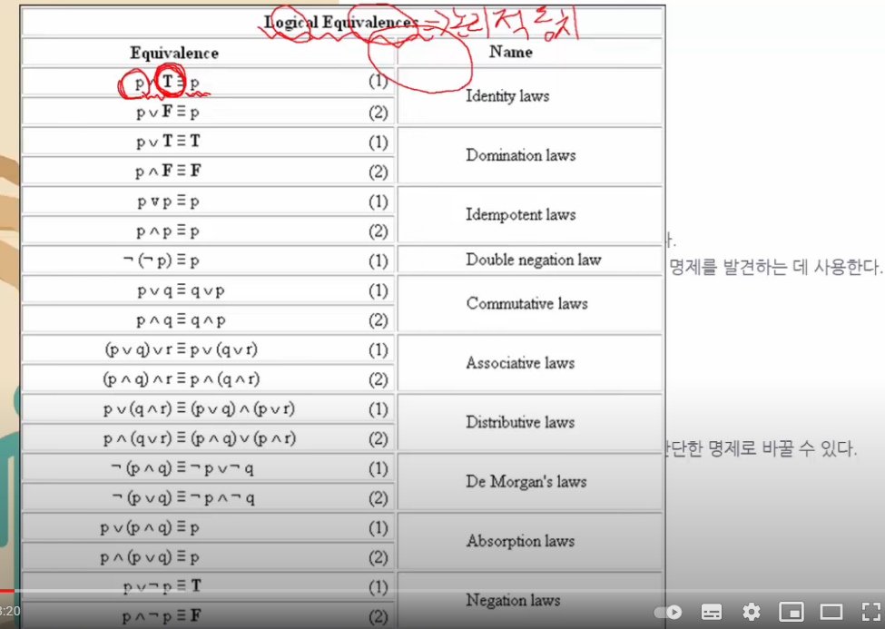

# 동치관계

> 동치란 '논리적으로 일치한다'는 의미이다. 흔히 동치는 같은 의미를 가진 더 쉬운 명제를 발견하는 데 사용한다. 동치법칙에는 다양한 종류가 있다.
>
> > 굉장히 복잡해 보이는 합성명제라도 동치법칙을 이용해 간단한 명제로 바꿀 수 있다.

### 동치법칙

위의 대부분의 식은 보면 아는 내용이고, 밑의 3개인 드모르간의 법칙, 흡수법칙, 부정법칙은 한번 봐보자

