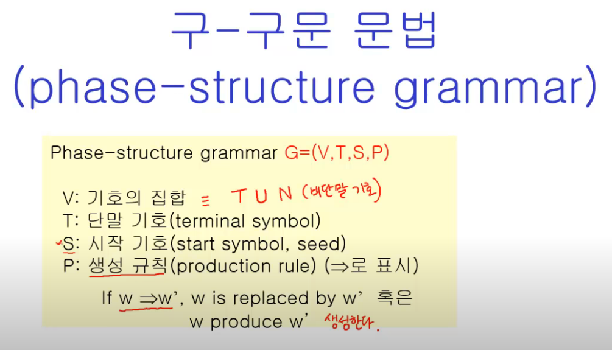
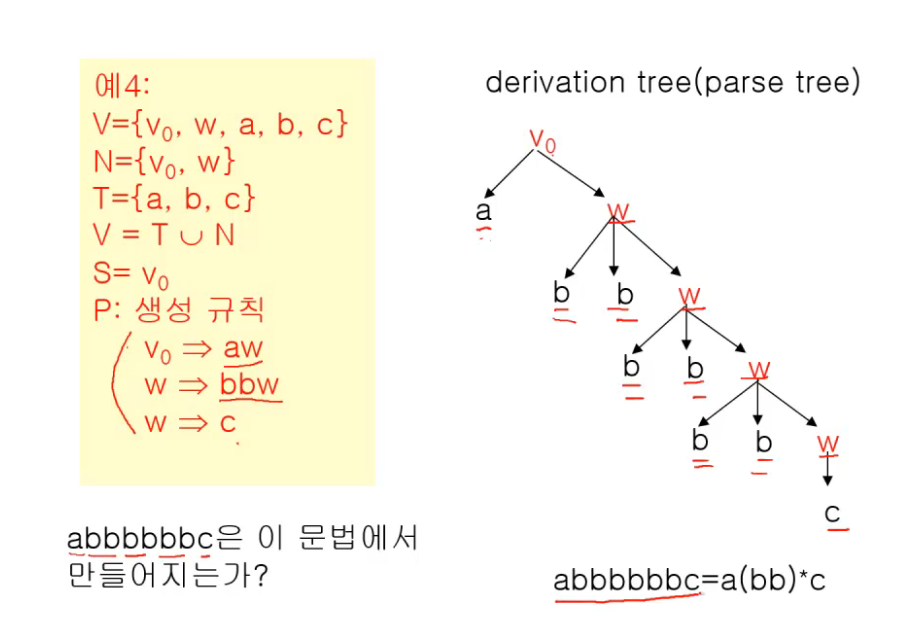
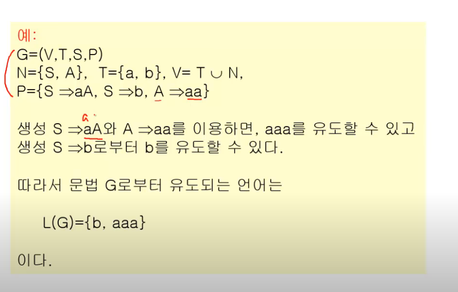
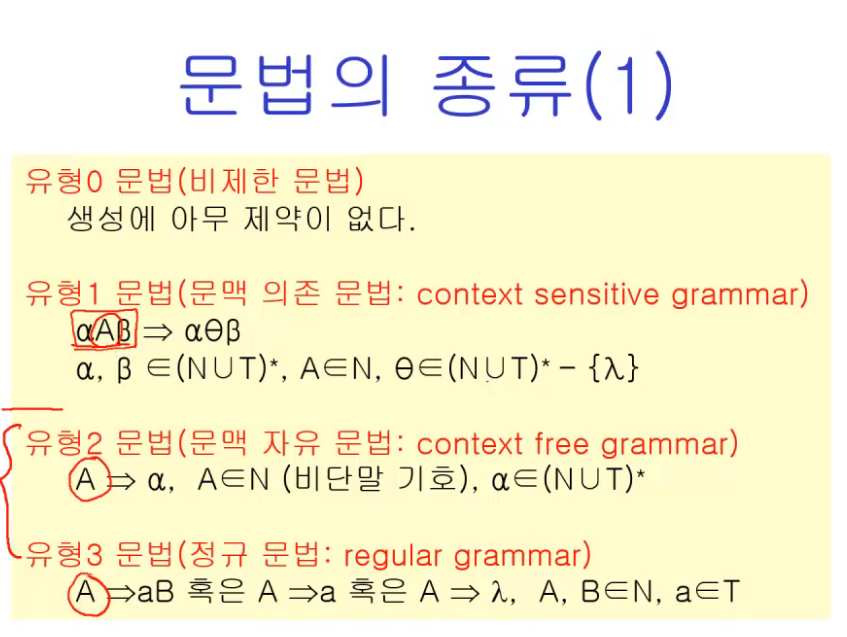

영상: https://www.youtube.com/playlist?list=PLD8rdlfZeJk7aDHa1VxqnX5TyQ4FmgavH

## 형식언어와 문법

### 언어

S: 기호들의 잡합

S*: S로부터 만들어지는 모든 유한 문자열들

예) S: 알파벳, S*: 모든 가능한 문장들

예) S: 정수, +, - , x, / S*: 모든 가능한 수식들

### 언어의 구성요소

언어: 다음의 세가지 요소로 구성된다.

1. (알파벳) 기호들의 집합 S가 반드시 존재한다.
2. S로부터 문장들의 집합 S*를 형성하는 규칙이 반드시 존재한다.
3. 규칙에 합당하게 만들어진 문장들이 어떤 의미를 갖는지를 결정할 수 있어야 한다.

### Syntax와 Semantics

Syntax: 문장의 적합한 구성에 대한 규정 (문법)

Semantics: 문장의 적합한 의미에 대한 규정 (의미론)

### 언어와 문법

정의 L(G): 문법 G의 언어, 문법G를 사용하여 만들어질 수 있느 문장들의 집합

ex)

#### 문법의 종류

## 정규식과 정규문법

-

## 유한상태기계

-

## 오토마타와 언어

오토마타

계산 능력이 있는 추상 기계와 그 기계를 이용해서 풀 수 있는 문제들을 연구하는 분야  
형식 언어를 정의하는 관점에서 컴파일러에서 구분 분석을 하면서 추상 구문 트리를 생성할 때  
계산 능력을 가진 추상 기계를 논하는 관점에서 계산 이론적으로 P-NP문제와도 연관성 있음

## 스트링 매칭 알고리즘

-

## 셈(순열과 조합) - 곱의 법칙과 합의 법칙

-
